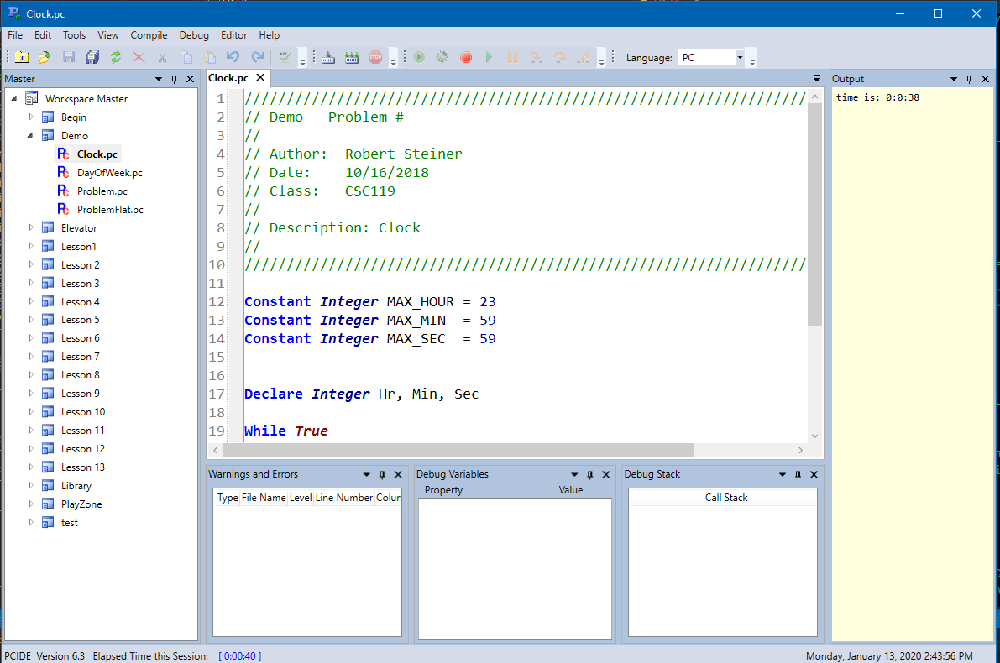

# PCIde
This is a full IDE for writing and running the pseudo code defined in **"Programming Logic and Design"** book by **Tony Gaddis**. I wrote the IDE and compiler for my students so they can try all the examples in the book and do the homework without having to setup complicated IDE environments.

## Features
*  Full syntax of book
*  Compiler
*  Editor            (uses Avalon Edit)
*  Multiple windows  (uses Avalon Dock)
*  Run and debug with breakpoints.
*  Adds file headers (template based)

## Screenshots

## Comments about implementation
I included a copy of the *Avalon* edit and dock repositories here to simplify my development and debugging. The workplace must be created first, see **How To ...**  documents in the *Document* folder.
